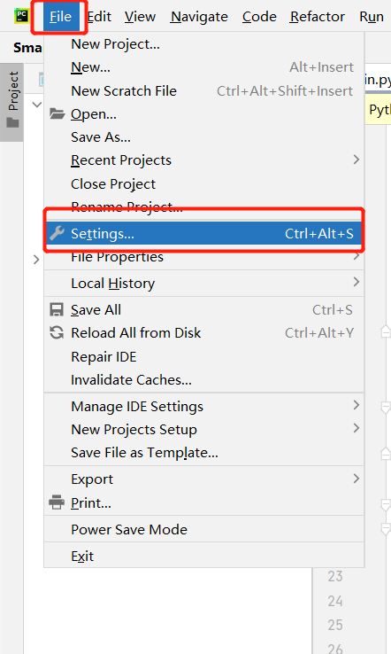
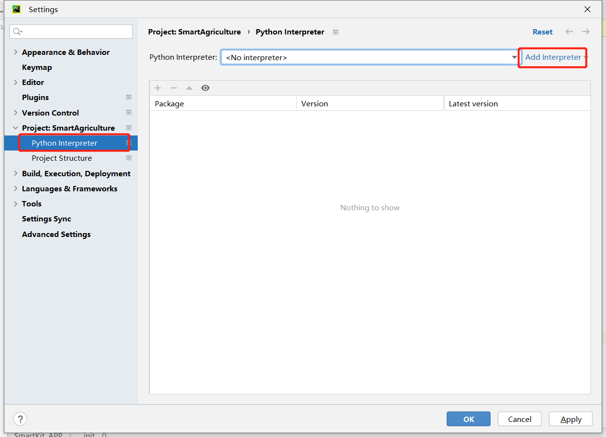

# 3D相机使用教程

## 一.环境配置

#### 1.下载驱动并安装

下载链接：https://developer.orbbec.com.cn/download.html?id=32

#### 2.pycharm创建虚拟环境

python版本：3.9

#### 3.相关包下载

##### 1）终端输入pip install -r requirements.txt

##### 2）将Ob_libs中的文件复制至./venv/Lib/site-packages中

